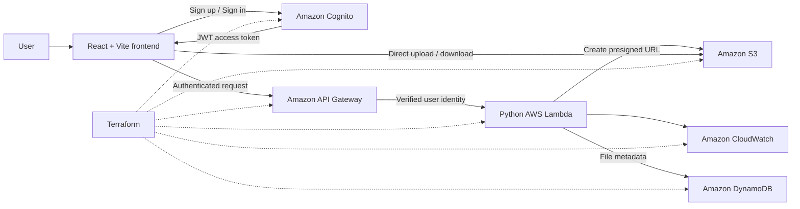

# CloudVault — Serverless File Storage

CloudVault is a private, serverless file-storage application built on AWS. It allows users to create an account, sign in, and manage files that are isolated from every other user's data.

The project combines a React frontend, a Python Lambda backend, managed AWS services, and reproducible Terraform infrastructure.

## Highlights

- Email signup, verification, sign-in, sign-out, and password recovery through Amazon Cognito
- JWT-protected API routes with API Gateway request throttling
- Per-user isolation across API operations, DynamoDB records, and S3 object keys
- Direct browser-to-S3 uploads and downloads using short-lived presigned URLs
- Serverless backend with no continuously running application server
- Infrastructure defined as code with Terraform
- Automated backend and authentication tests

## Architecture



### Request flow

1. The user authenticates through the Cognito managed login. AWS Amplify Auth manages the browser authentication flow and session.
2. The frontend attaches the Cognito access token to each API request.
3. API Gateway validates the JWT before forwarding the request to Lambda.
4. Lambda reads the verified Cognito user ID and uses it to scope every file operation.
5. For uploads and downloads, Lambda returns a short-lived S3 presigned URL. File data travels directly between the browser and S3 rather than through Lambda.
6. DynamoDB stores file metadata, while S3 stores the file contents.

## AWS services

| Service | Responsibility |
| --- | --- |
| Amazon Cognito | User registration, email verification, managed login, and token issuance |
| Amazon API Gateway | HTTP API routing, JWT authorization, CORS, and request throttling |
| AWS Lambda | File-management API and presigned URL generation |
| Amazon S3 | Encrypted file storage and direct presigned transfers |
| Amazon DynamoDB | Per-user file metadata |
| Amazon CloudWatch | Lambda logs, retention, and error monitoring |
| AWS IAM | Least-privilege permissions for the Lambda function |
| Terraform | Repeatable provisioning and removal of the AWS stack |

## Technology stack

- **Frontend:** React 19, Vite, AWS Amplify Auth
- **Backend:** Python 3.13, AWS Lambda, Boto3
- **API and authentication:** API Gateway HTTP API, Amazon Cognito, JWT
- **Storage:** Amazon S3, Amazon DynamoDB
- **Infrastructure:** Terraform
- **Testing:** pytest, Moto, Node.js test runner

## Security model

CloudVault does not trust a user ID supplied by the browser. API Gateway verifies the Cognito access token, and Lambda derives ownership from the verified `sub` claim. That identity is included in DynamoDB keys and S3 paths so one authenticated user cannot list, download, or delete another user's files through the API.

Additional controls include:

- A Cognito application client without a client secret, suitable for a browser application
- OAuth authorization-code flow with PKCE, managed by Amplify Auth
- Short-lived presigned upload and download URLs
- S3 public-access blocking and server-side encryption
- Upload size and content validation
- API Gateway throttling at 5 requests per second with a burst capacity of 10
- Restricted CORS configuration and scoped Lambda permissions

## Repository structure

```text
cloudvault/
├── frontend/          React application and Amplify Auth integration
├── backend/
│   ├── app/           Python Lambda handler and file operations
│   └── tests/         Backend and infrastructure contract tests
├── terraform/         AWS infrastructure definitions
└── docs/              Architecture notes and implementation plans
```

## Run locally

### Prerequisites

- Node.js 20 or later and npm
- Python 3.13 and pip
- Terraform 1.x
- AWS CLI configured with credentials for an AWS account

AWS resources incur usage charges. Review the Terraform plan before applying it and destroy the stack when it is no longer needed.

### 1. Provision the AWS infrastructure

```bash
terraform -chdir=terraform init
terraform -chdir=terraform plan
terraform -chdir=terraform apply
```

Terraform prints the API URL and Cognito values required by the frontend:

```bash
terraform -chdir=terraform output
```

### 2. Configure the frontend

```bash
cp frontend/.env.example frontend/.env
```

Replace the example values in `frontend/.env` with the corresponding Terraform outputs:

```env
VITE_API_URL=<api_url>
VITE_COGNITO_USER_POOL_ID=<cognito_user_pool_id>
VITE_COGNITO_USER_POOL_CLIENT_ID=<cognito_user_pool_client_id>
VITE_COGNITO_DOMAIN=<cognito_domain>
```

### 3. Start the application

```bash
cd frontend
npm install
npm run dev
```

Open `http://localhost:5173`, create an account, verify the email address, and sign in.

## Verification

Run the backend tests:

```bash
python3 -m venv .venv
source .venv/bin/activate
pip install -r backend/requirements-dev.txt
pytest
```

Run the frontend checks:

```bash
cd frontend
npm install
npm test
npm run lint
npm run build
```

Validate the Terraform configuration:

```bash
terraform -chdir=terraform init -backend=false
terraform -chdir=terraform validate
```

## Remove the AWS resources

To avoid retaining resources and associated charges:

```bash
terraform -chdir=terraform destroy
```

This permanently removes the Terraform-managed CloudVault stack, including stored files and registered Cognito users.
